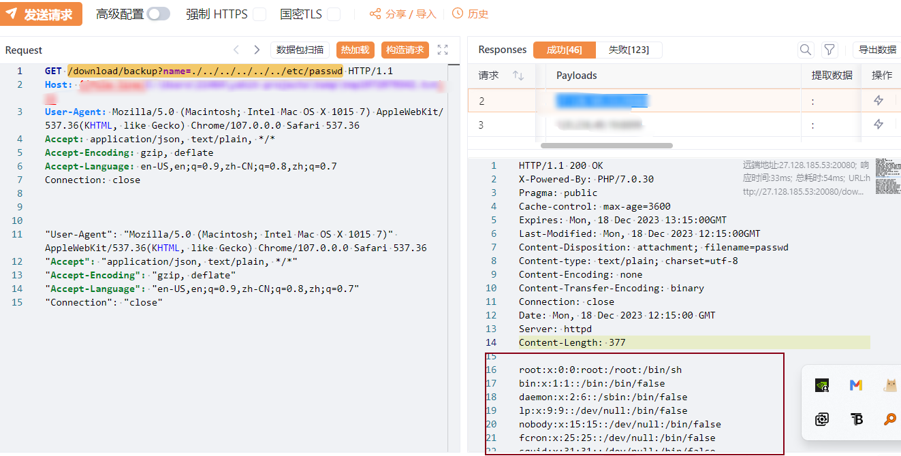
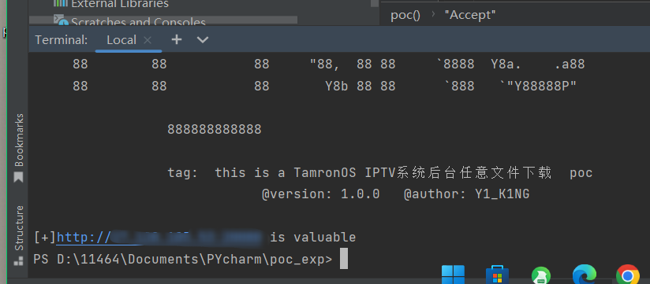
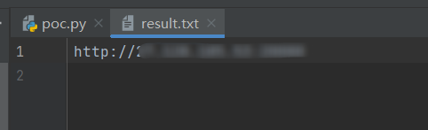

## 漏洞描述

TamronOS IPTV系统存在任意文件下载

## 漏洞影响

TamronOS IPTV V5 3.6.6

## FOFA

title="TamronOS IPTV系统"

# 使用

python poc.py -u ip:port

python poc.py -f url.txt

由于传播、利用所发布的项目造成的任何直接或者间接的后果及损失，均由使用者本人承担。原文章作者不为此承担任何责任，一旦造成后果请自行承担！如有侵权烦请告知，我们会立即删除并致歉。谢谢！

